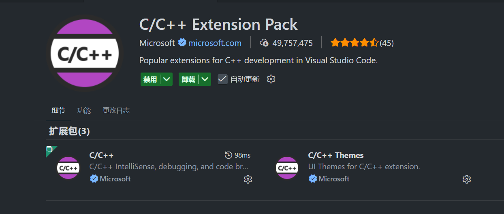
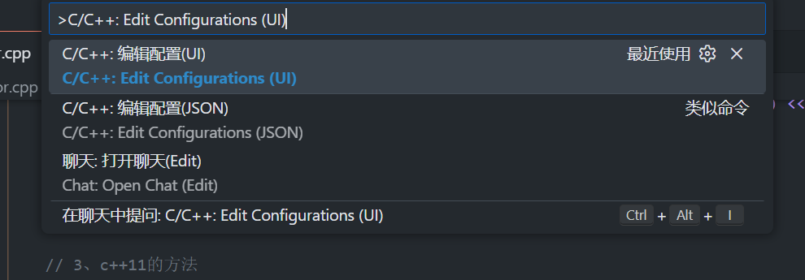
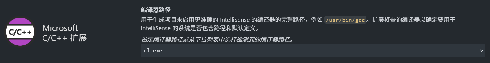

## VScode打开VS工程+编译+运行

**前言**

​	由于VS是一个集成开发环境（IDE），他有一趟自己的构建系统（MSBuild），而VS Code只是一个编辑器，它默认是不认识 .sln文件的，需要通过以下步骤实现。


### 第一步：准备环境

为了让 VS Code 能用上 VS 的编译器（MSVC），你需要做两件事：

1. **安装插件**：在 VS Code 中安装 **C/C++ Extension Pack**。

   

2. **正确的启动方式 (关键)**：

   - ❗不要直接点击图标打开 VS Code。
   - 在 Windows 搜索栏找 **"Developer Command Prompt for VS"** 
   - 在打开的黑窗口中，输入命令进入你的项目文件夹，然后输入 `code .` 启动 VS Code。
   - *原因：这样做可以让 VS Code 继承 VS 的环境变量（找到 `cl.exe` 和 `msbuild.exe`）。*


### 第二步：配置IntelliSense

当你用上述步骤打开项目文件夹后（有报错先不管）

1. 按 `Ctrl + Shift + P`，输入 **C/C++: Edit Configurations (UI)**。

   

2. 在 **Compiler Path** (编译器路径) 中，选择 `cl.exe` (通常是 `amd64` 或 `x86` 版本)。

   

   - *只要你是通过上面的“Developer Command Prompt”启动的，这里通常会自动识别出来。*

3. **IntelliSense Mode** 选择 `windows-msvc-x64`。


### 第三步：编译运行（实测有效）

#### 利用原有的 .sln 文件编译 (推荐，最省事)

既然你已经有 `.sln` 文件了，最简单的方法是调用 VS 的构建工具 `msbuild`。

1. 在 VS Code 中打开终端 (`Ctrl + ~`)。

2. 输入构建命令：

   ```
   msbuild 该文件路劲下的解决方案名.sln
   ```

   (如果只有一个 .sln文件，直接输入msbuild即可)

3. 编译成功后，可执行文件 (`.exe`) 通常会生成在 `Debug` 或 `x64/Debug` 文件夹下。

4. 在终端运行(观察 .exe可执行文件在哪个Debug文件下)

   ```DOS
   .\x64/Debug\你的程序名.exe
   ```

   


### 第四步：调试（之后开发）


