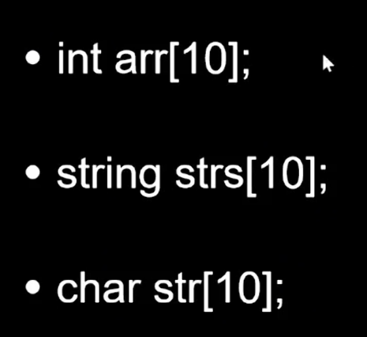
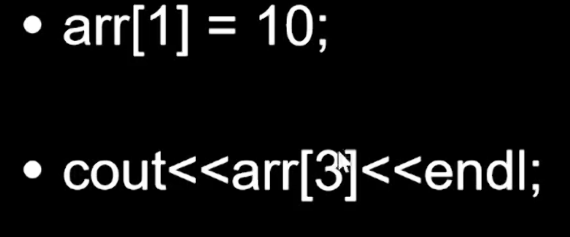
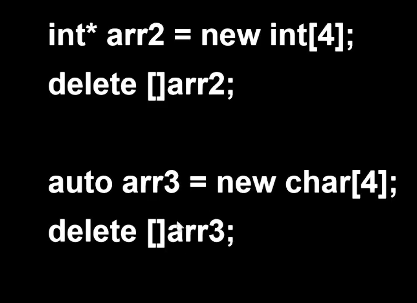

## 数组

C++中包含三种数组，分别是

:point_right:栈区数组

:point_right:堆区数组

:point_right:容器数组vector


### 栈区数组

- 类型 变量名[数组数量]



​	二维数组申请方法

```c++
int arr[10][101];
```

- 空间大小申请


```c++
	// 编译时常量
	constexpr int cy{ 200 };
	cout << "cy: " << cy << std::endl;
```


- 空间大小计算


​	数组如果通过参数动态传递时，得不到对应数组的空间大小，此时数组是作为指针传递

- 元素读写



- 代码示例

'''

### 堆区数组

- 堆区数组的申请方法 ==类型* 数组名 = new 类型名[数组大小]==

​	**:exclamation:堆区数组每次申请完需要进行释放**  delete []数组名;



- 空间手动释放并赋值为空指针(nullptr)
- 空间大小自行控制


🤖对比`栈区数组`与`堆区数组`

- 栈区数组与堆区数组的创建方式不同
- 栈区数组的数组大小只能是编译时常量，堆区数组数组大小可以是变量，可以用户自行设置
- 栈区数组可以使用c++11的for循环遍历，而堆区数组只能用传统方法遍历
- 堆区数组每次用完后需要  **删除数组**`delete[] arr1`、**赋为空指针**`arr1 = nullptr`
- 堆区数组和栈区数组都可以进行**内存复制**`memcpy`的操作，但要记得用完堆区数组需要删除数组、赋空指针


### 容器数组vector

- 首先使用容器数组时，需要引用头文件 <vector.h>

```c++
#include <vector.h>
std::vector // 如果没有using namespace
```

- 创建vector数组容器 vector<元素类型> 变量名 （初始化数量）

​	不同类型的vector<元素类型>之间不能相互传参

```c++
vetor<int> vi(10);
```

​	==vector<元素类型> 组合起来是它的实际类型，通过模板编译前生成。==

​	vector<元素类型>支持二维数组，元素类型支持嵌套，实现二维数组

```c++
// vector 申请一个二维数组的方法
int rows = 5;
int cols = 3;
int initialValue = 0;

// 创建一个 5行 3列 的二维数组，所有元素初始化为 0
vector<vector<int>> matrix(rows, vector<int>(cols, initialValue));

// 访问元素
matrix[2][1] = 99; // 修改第3行第2列的元素
```

- 空间申请

​	vector容器数组的空间大小： 支持变量、 支持动态扩充

- 支持增删查

​	增加：

​		push_back

```c++
	void push_back(T&& value);
```

​		insert	insert是在vectro数组中某个位置插入值，本质是将其后的值后移，会有性能消耗

```c++
	iterator insert(iterator pos , const T& value);
```

​	删除：

​		erase 删除也有开销

```c++
	iterator erase(iterator pos);
```

​	查找：

​		find 

```c++
Inputlt find(Inputlt first , Inputlt last , const T& value);
```


 


