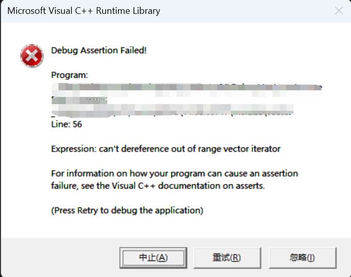
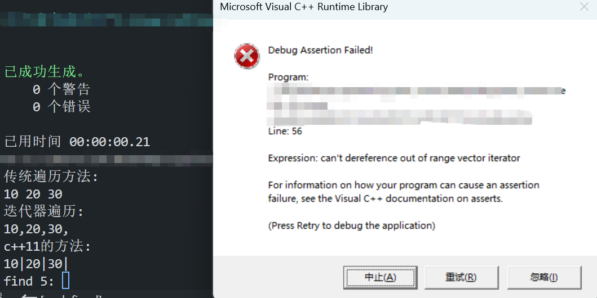
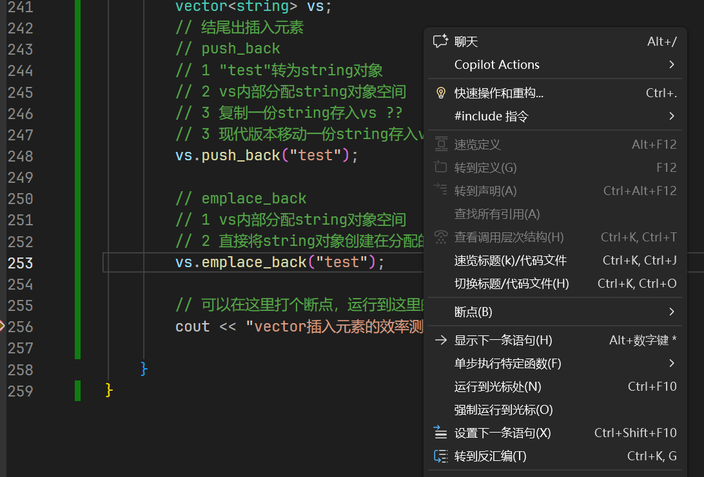
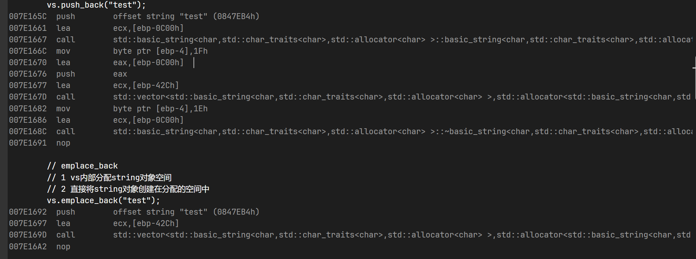

## 容器数组

### 容器数组vector

- 首先使用容器数组时，需要引用头文件 <vector.h>

```c++
#include <vector.h>
std::vector // 如果没有using namespace
```

- 创建vector数组容器 vector<元素类型> 变量名 （初始化数量）

​	不同类型的vector<元素类型>之间不能相互传参

```c++
vetor<int> vi(10);
```

​	==vector<元素类型> 组合起来是它的实际类型，通过模板编译前生成。==

​	vector<元素类型>支持二维数组，元素类型支持嵌套，实现二维数组

```c++
// vector 申请一个二维数组的方法
int rows = 5;
int cols = 3;
int initialValue = 0;

// 创建一个 5行 3列 的二维数组，所有元素初始化为 0
vector<vector<int>> matrix(rows, vector<int>(cols, initialValue));

// 访问元素
matrix[2][1] = 99; // 修改第3行第2列的元素
```

- 空间申请

​	vector容器数组的空间大小： 支持变量、 支持动态扩充

- 支持增删查

​	增加：

​		push_back

```c++
	void push_back(T&& value);
```

​		insert	insert是在vectro数组中某个位置插入值，本质是将其后的值后移，会有性能消耗

```c++
	iterator insert(iterator pos , const T& value);
```

​	删除：

​		erase 删除也有开销

```c++
	iterator erase(iterator pos);
```

​	查找：

​		find 

```c++
Inputlt find(Inputlt first , Inputlt last , const T& value);
```


注意：

- find返回的值是一个迭代器类型的值，将他类似于指针的使用即可
- 如果find需要查找的值不存在时，运行时会报错

**在VS中报错为**

```C++
std::vector<int>datas{ 1,2,3,4,5,6,7,8,9,10,5,12,331,334,134,11};
auto f = find(datas.begin(), datas.end(), 99); // 查找99是否存在
```




**在VS code中报错显示为**（此时编译不会报错，运行才报错）




### **需要插入值insert**时

insert插入多个值时，易犯的错误

**出现野指针**

直接运行

```C++
datas.insert(f + 1,332);
datas.insert(f + 2,333);
```

由于采用insert使得vector内部发生了变化，此时迭代器 f 变成了==野指针==，运行第二条时就报错了

正确做法，实时更新指针指向地址

```C++
// datas.insert(f + 1,332);
// 注意：当你执行第一句 datas.insert(f+1, 332); 时，
// vector 的内部结构发生了变化，导致旧的迭代器 f 变成了“野指针”
// datas.insert(f + 2,333);
// 正确做法
f = datas.insert(f+1,332); // 插在331后面
f = datas.insert(f+1,333); // 此时f是332的地址
```


### vector插入元素的效率--push_back与emplace_back

#### push_back的创建方法

```c++
vector<string> vs;
vs.push_back("test");
```

通过上述的代码可以知道，

push_back的创建方法：

1、"test"转为string对象

2、vs内部分配string对象空间

3、现代方法是通过移动一份string对象存入vs中

#### emplace_back的创建方法

```c++
vector<string> vs;
vs.emplace_back("test");
```

通过上述的代码可以知道，

emplace_back的创建方法：

1、vs内部分配string对象空间

2、直接将string对象创建在vs分配的空间中


可以通过断点的方法区分这两种创建方法



在这两个代码运行下一行打个断点，运行后，右键选择==转到反编译==



可以从代码量的区别看出，emplace_back插入元素的执行效率更高


但是，注意

emplace_back和push_back需要插入类元素时

```c++
vs.push_back(string("test")); // ✔️
vs.emplace_back("test");      // ✔️
```

emplace_back写成    emplace_back(*string("test")*);   ❌

```C++
vs.push_back();      // ❌
vs.emplace_back();   // ✔️
```


